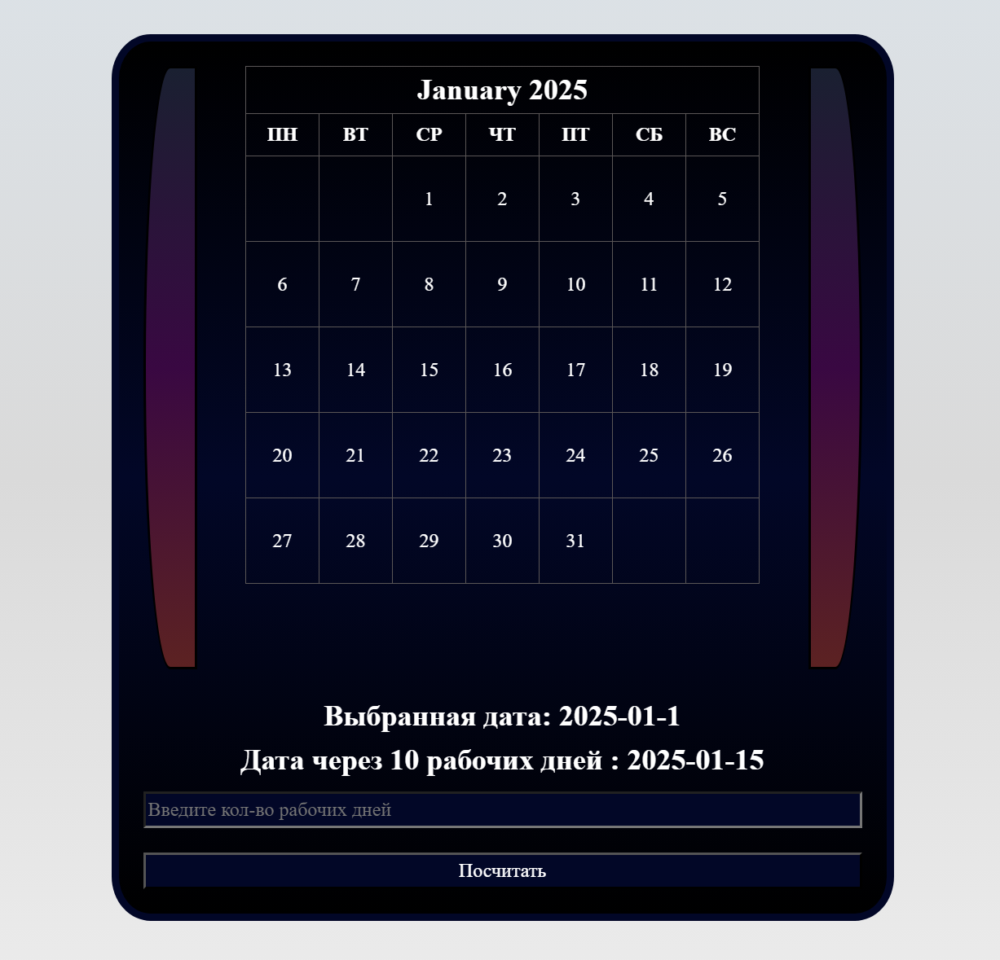

Реализация производственного календаря.
Пользователь выбирает дату и интервал, после нажатия на 
кнопку "Посчитать" выводится дата, которая наступит 
через введенное количества рабочих дней.
Справа и слева расположенны кнопки для изменения даты.

normalize.css - нормализация стилей
style.css - основные стили
calendar.php - реализация календаря
index.php фон страницы
slider.js - скрипт для слайдера  

Время выполнения: 7 ч

